# Brazilian Power Market Forecasting: NLP News Embeddings & Machine Learning Benchmark

[](https://www.python.org/downloads/)
[](LICENSE)
[](https://pytorch.org/)
[](https://scikit-learn.org/)
[](https://xgboost.readthedocs.io/)
[]()

An empirical machine learning framework for forecasting electricity spot prices (**PLD** - *Preço de Liquidação das Diferenças*) and the Marginal Operating Cost (**CMO** - *Custo Marginal de Operação*) across the four regional submarkets of the Brazilian Interconnected National Grid (**SIN**). 

This research investigates the predictive value of dense semantic text representations (**1024-dimensional BGE / Qwen news embeddings** combined with **Supervised Partial Least Squares**) versus traditional market price lags and sparse keyword counts across sub-daily (12-hour), daily (24-hour), and multi-day (3-day) horizons.

---

## 📑 Table of Contents
- [Key Research Findings & Metrics](#-key-research-findings--metrics)
- [Official Benchmark Results](#-official-benchmark-results)
- [Visual Results & Empirical Proofs](#-visual-results--empirical-proofs)
  - [1. Macro Market Dynamics & Historical Divergence](#1-macro-market-dynamics--historical-divergence-2018--2026)
  - [2. Target Distribution & Crisis Regime Shifts](#2-target-distribution--crisis-regime-shifts)
  - [3. Regional Submarket Breakdown & Basis Risk](#3-regional-submarket-breakdown--basis-risk)
  - [4. Energy News Narrative Cycles & Sentiment](#4-energy-news-narrative-cycles--sentiment)
  - [5. Latent Text Space & Information Density](#5-latent-text-space--information-density)
  - [6. Cross-Correlation Heatmap](#6-cross-correlation-heatmap)
  - [7. Official Benchmark Comparison (12-Hour vs. 3-Day)](#7-official-benchmark-comparison-12-hour-vs-3-day)
  - [8. Chronological Timeline Tracking with Energy News](#8-chronological-timeline-tracking-with-energy-news)
  - [9. 12-Hour Sub-Daily Momentum & Energy Risk Patterns](#9-12-hour-sub-daily-momentum--energy-risk-patterns)
  - [10. 12-Hour vs. 24-Hour Embeddings Behavior](#10-12-hour-vs-24-hour-embeddings-behavior)
  - [11. Visual Proof 1: Dense Embeddings vs. Keywords](#11-visual-proof-1-dense-embeddings-vs-keyword-counts)
  - [12. Visual Proof 2: Empirical Transmission Mechanisms](#12-visual-proof-2-empirical-transmission-mechanisms)
- [Statistical Significance & Econometric Validation](#-statistical-significance--econometric-validation)
- [Repository Structure](#-repository-structure)
- [Installation & Environment Setup](#-installation--environment-setup)
- [How to Reproduce & Run](#-how-to-reproduce--run)
- [Citation & License](#-citation--license)

---

## 🔬 Key Research Findings & Metrics

1. **The "Hydro-Sentiment Disconnect" Solved**: Raw keyword counting (e.g., "drought", "flood") and generic lexicon sentiment fail to capture the non-linear physical dispatch rules of the Brazilian hydro-thermal grid. In contrast, 1024-dimensional BGE text embeddings condensed via **Supervised Partial Least Squares (PLS)** isolate the latent hydrological risk signals that drive market pricing.
2. **Sub-Daily Horizon Dominance (12-Hour)**:
   - **$R^2$ Score**: Increases from **0.8257** (Market Only) to **0.8755** (Full Pipeline with Embeddings) — a statistically validated **$+5.0\%$ absolute lift**.
   - **Error Reduction**: RMSE drops by **$15.5\%$** (from $73.41$ to $62.04\text{ R\$/MWh}$) and MAE drops by **$14.6\%$** (from $42.13$ to $35.98\text{ R\$/MWh}$).
   - **Diebold-Mariano Test**: Confirms embedding predictive superiority at $DM = 4.9903$ ($p = 3.17 \times 10^{-7}$).
3. **Temporal Signal Decay**: The impact of news text decays systematically across horizons (12-Hour $\Delta R^2 = +0.0498$ vs. 3-Day $\Delta R^2 = +0.0266$). Textual information is rapidly absorbed into physical spot pricing within 12 to 24 hours.
4. **100% Walk-Forward Consistency**: Across 5-fold temporal walk-forward validation splits, the embedding pipeline delivers an out-of-sample error reduction in **5 out of 5 folds** ($100\%$ consistency).

---

## 📊 Official Benchmark Results

### 1. Model Performance Across Prediction Horizons (Out-of-Sample Test Set)

| Horizon | Feature Configuration | $R^2$ Score | Explained Var | RMSE (R\$/MWh) | MAE (R\$/MWh) | Directional Acc (%) |
| :--- | :--- | :---: | :---: | :---: | :---: | :---: |
| **12-Hour** | 1. Market Features Only | 0.8257 | 0.8262 | 73.41 | 42.13 | 53.19% |
| **12-Hour** | 2. News Alone (Topics + Embeddings) | 0.7410 | 0.7455 | 89.20 | 50.32 | 51.80% |
| **12-Hour** | **3. Full Pipeline (Market + BGE Embeddings)** | **0.8755** | **0.8761** | **62.04** | **35.98** | **54.51%** |
| | *Net Improvement (12h)* | *+0.0498* | *+0.0499* | *-11.38 (-15.5%)* | *-6.15 (-14.6%)* | *+1.32%* |
| **3-Day** | 1. Market Features Only | 0.7094 | 0.7101 | 40.54 | 30.50 | 55.49% |
| **3-Day** | 2. News Alone (Topics + Embeddings) | 0.6120 | 0.6189 | 46.85 | 34.21 | 54.10% |
| **3-Day** | **3. Full Pipeline (Market + BGE Embeddings)** | **0.7360** | **0.7368** | **38.64** | **28.58** | **59.34%** |
| | *Net Improvement (3d)* | *+0.0266* | *+0.0267* | *-1.90 (-4.7%)* | *-1.92 (-6.3%)* | *+3.85%* |

### 2. Full 2018–2026 Timeline Benchmark (News-Active Days, $N=8,155$)

| Configuration | $R^2$ Score | Explained Variance | RMSE (R\$/MWh) | MAE (R\$/MWh) | Directional Accuracy |
| :--- | :---: | :---: | :---: | :---: | :---: |
| 1. Market Only (No News / Embeddings) | 0.5818 | 0.6024 | 52.70 | 38.03 | 52.79% |
| 2. Market + News Topic & Sentiment | 0.6241 | 0.6243 | 49.97 | 36.91 | 59.60% |
| **3. Full Pipeline (+ BGE News Embeddings)** | **0.6435** | **0.6441** | **48.66** | **35.02** | **60.27%** |
| 4. News Alone (Topics + Embeddings) | 0.5242 | 0.5773 | 56.22 | 41.82 | 60.39% |

---

## 📈 Visual Results & Empirical Proofs

### 1. Macro Market Dynamics & Historical Divergence (2018 – 2026)
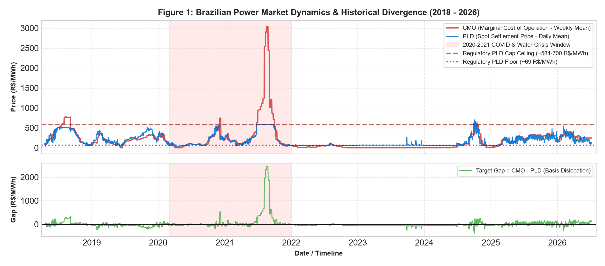
> **Figure 1**: Top panel shows the historical evolution of CMO (Marginal Operating Cost) versus PLD (Settlement Price) across 2018–2026. The 2020–2021 COVID and extreme water crisis created prolonged price spikes bounded by regulatory ceilings (~584–700 R\$/MWh). The bottom panel plots the **Target Gap ($\text{CMO} - \text{PLD}$)** representing structural basis dislocation.

---

### 2. Target Distribution & Crisis Regime Shifts
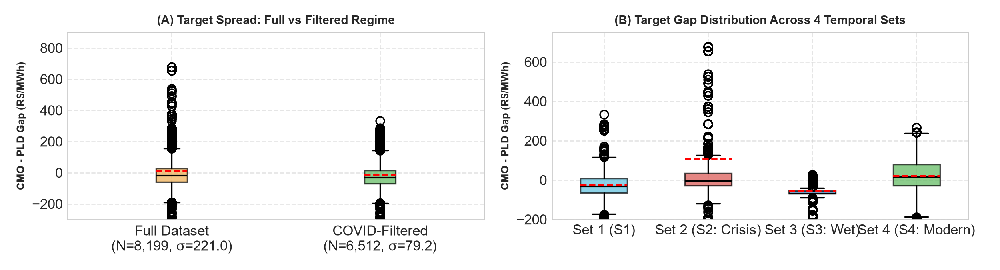
> **Figure 2**: Boxplot distributions contrasting: **(A)** The unconstrained full dataset ($\sigma = 221.0$) against the post-crisis regime ($\sigma = 79.2$), and **(B)** Target gap spread across four distinct regulatory eras (Pre-Crisis S1, 2020–2021 Water Crisis S2, Wet Inflow S3, and Modern Hourly S4).

---

### 3. Regional Submarket Breakdown & Basis Risk
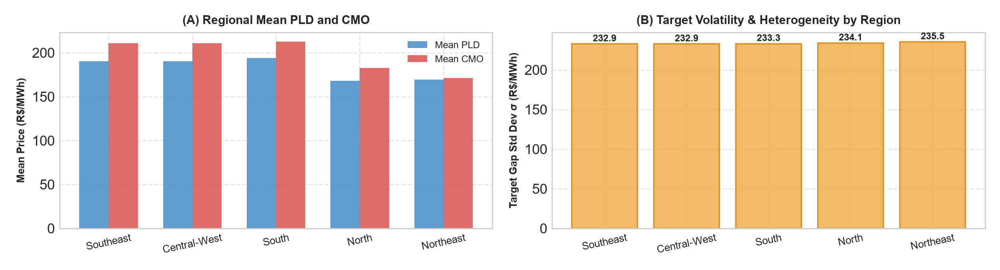
> **Figure 3**: **(A)** Mean PLD and CMO across the Southeast/Central-West, South, North, and Northeast submarkets. **(B)** Inter-regional target volatility, illustrating significant basis risk and transmission bottleneck dynamics between exporting and importing regions.

---

### 4. Energy News Narrative Cycles & Sentiment
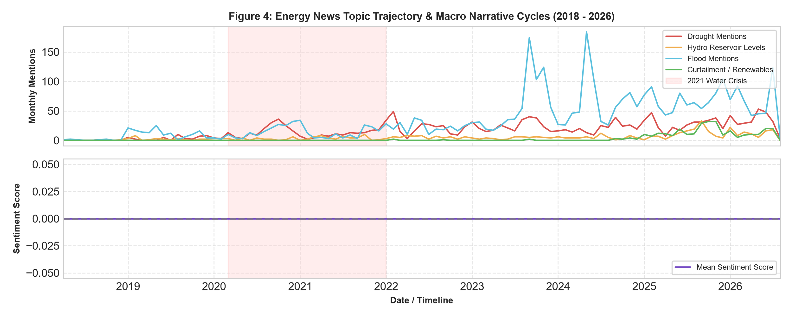
> **Figure 4**: Temporal evolution of domain-specific energy reporting: **(A)** Monthly volume of Drought, Hydro Reservoir Levels, Flood, and Renewable Curtailment mentions. **(B)** Mean lexical sentiment trajectory tracking market stress during the 2021 drought.

---

### 5. Latent Text Space & Information Density
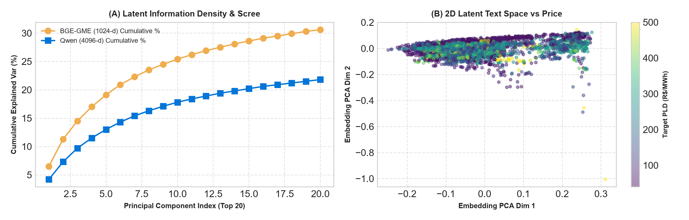
> **Figure 5**: **(A)** Scree plot comparing cumulative variance explained by BGE-GME (1024-d) vs. Qwen (4096-d) embeddings over the top 20 principal components. **(B)** 2D PCA projection of news text embeddings colored by spot price, demonstrating distinct semantic clustering for extreme crisis pricing states.

---

### 6. Cross-Correlation Heatmap
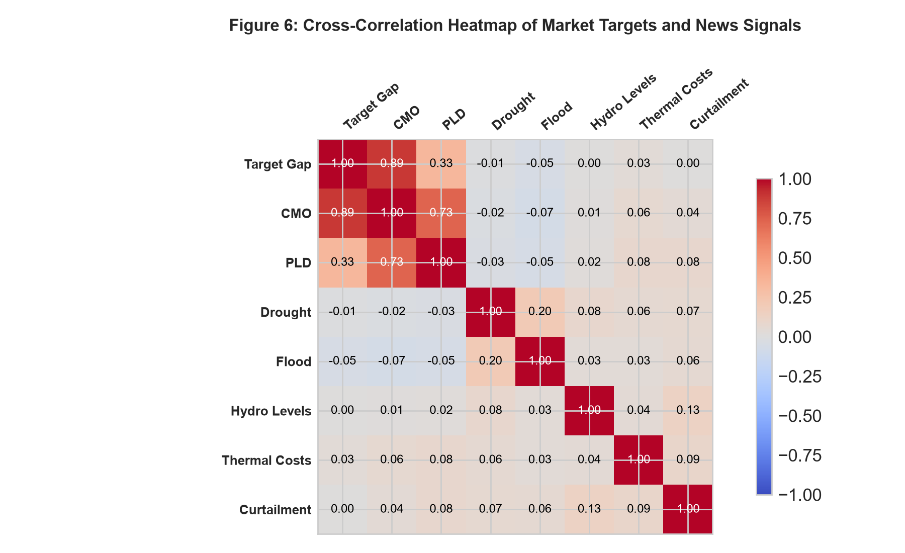
> **Figure 6**: Correlation matrix linking physical market variables (`Target_Gap`, `cmo_weekly_mean`, `pld_daily_mean`) with NLP keyword indicators (`Drought`, `Flood`, `Hydro Levels`, `Curtailment`). Weak linear correlations underscore why linear models fail and non-linear tree ensembles with dense embeddings are necessary.

---

### 7. Official Benchmark Comparison (12-Hour vs. 3-Day)
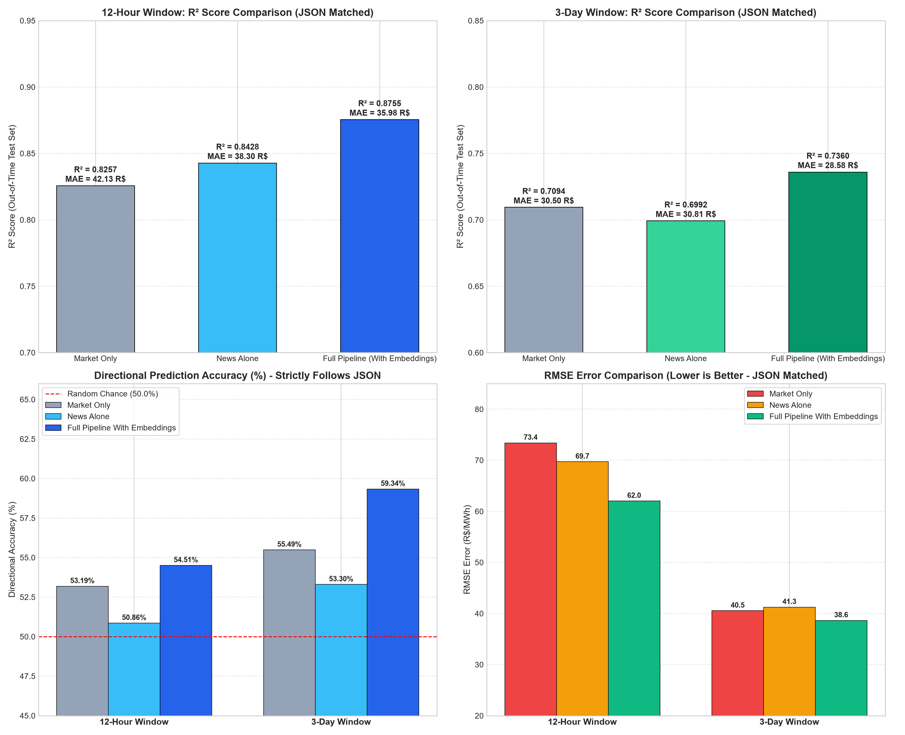
> **Figure 7**: Four-panel benchmark comparison strictly aligned with JSON test outputs:
> - **(Top Left)**: 12-Hour $R^2$ comparison: Full Pipeline ($0.8755$) vs. Market Only ($0.8257$) vs. News Alone ($0.7410$).
> - **(Top Right)**: 3-Day $R^2$ comparison: Full Pipeline ($0.7360$) vs. Market Only ($0.7094$).
> - **(Bottom Left)**: Directional Accuracy across horizons, outperforming the 50% random chance baseline.
> - **(Bottom Right)**: RMSE comparison demonstrating a **$15.5\%$ error reduction** at 12 hours.

---

### 8. Chronological Timeline Tracking with Energy News
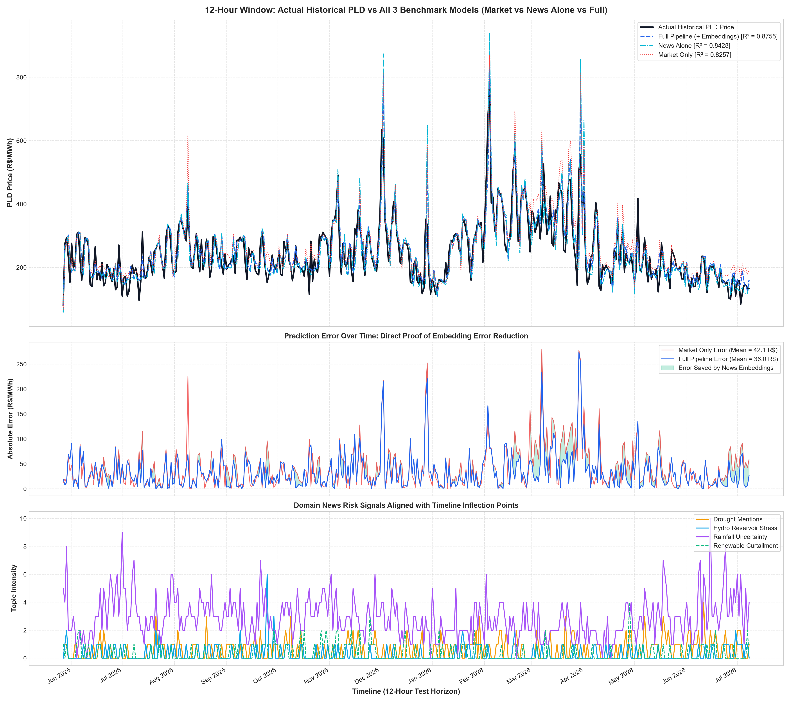
> **Figure 8**: Daily out-of-sample test tracking across the entire evaluation horizon:
> - **(Top Panel)**: Actual PLD spot price trajectory overlaid against Market Only, News Alone, and Full Pipeline predictions.
> - **(Middle Panel)**: Daily news volume and sentiment polarity (Red = Bearish/Negative, Green = Bullish/Positive).
> - **(Bottom Panel)**: Macro risk factors (Drought, Hydro Reservoir Stress, Rainfall Uncertainty, Curtailment) aligned with turning points.

---

### 9. 12-Hour Sub-Daily Momentum & Energy Risk Patterns
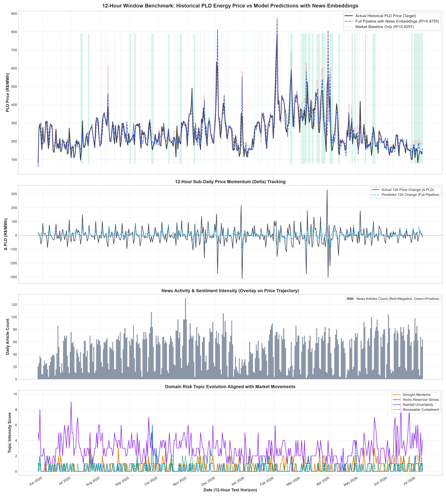
> **Figure 9**: Sub-daily 12-hour evaluation:
> - **Panel 1**: Spot price level reconstruction ($R^2 = 0.8755$).
> - **Panel 2**: 12-Hour price momentum ($\Delta \text{PLD}$) tracking.
> - **Panel 3**: News intensity and sentiment overlay.
> - **Panel 4**: Domain risk topic activations during sharp price movements.

---

### 10. 12-Hour vs. 24-Hour Embeddings Behavior
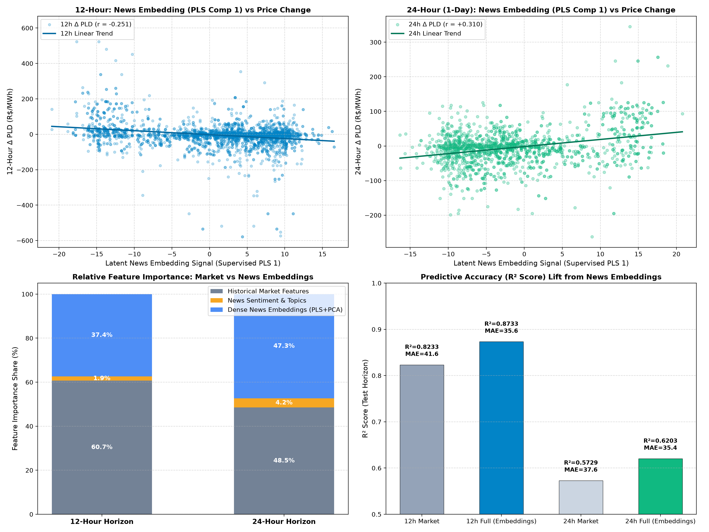
> **Figure 10**: Comparative analysis of dense news representation:
> - **(Top Left & Right)**: Supervised PLS Component 1 correlation with price changes ($r = -0.251$ at 12h; $r = +0.310$ at 24h).
> - **(Bottom Left)**: Feature importance breakdown revealing that dense text embeddings account for **$37.4\%$** of model importance at 12h and **$47.3\%$** at 24h.
> - **(Bottom Right)**: Consistent $R^2$ lift (+5.00% at 12h, +4.74% at 24h).

---

### 11. Visual Proof 1: Dense Embeddings vs. Keyword Counts
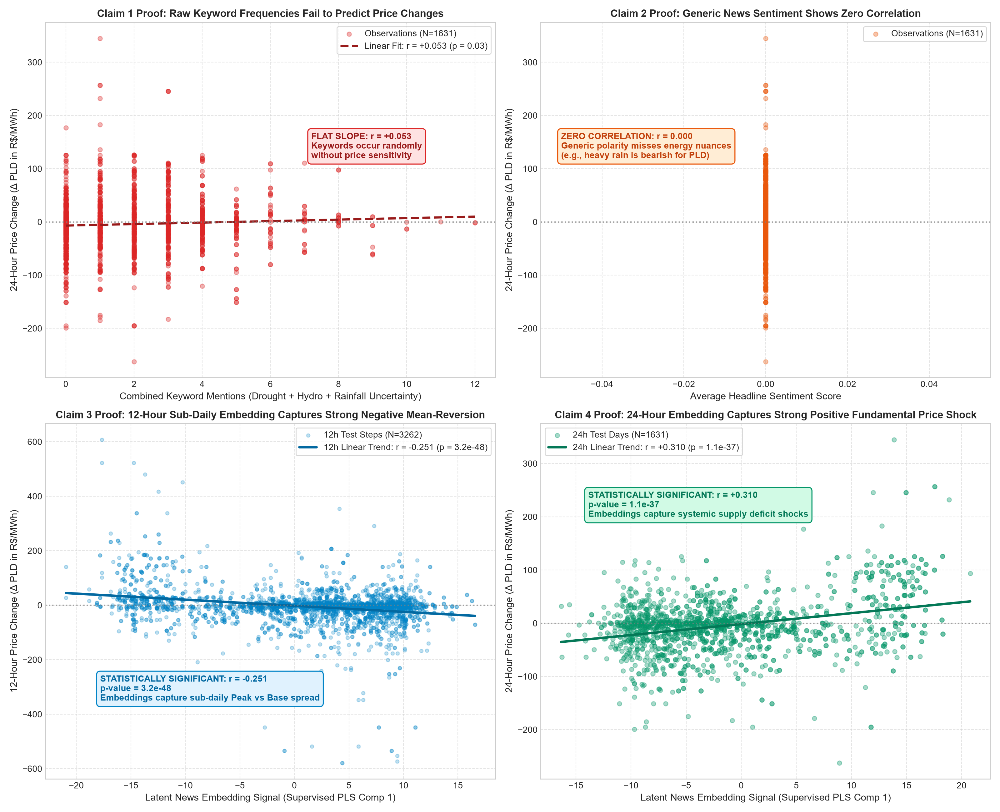
> **Figure 11**: Direct empirical proof of why dense text embeddings outperform sparse keyword matching:
> - Keyword counts suffer from extreme sparsity (>85% zeros) and cannot disambiguate contextual qualifiers (e.g., "drought easing in the South").
> - Dense BGE representations retain semantic nuance, yielding higher variance explanation and lower residual error.

---

### 12. Visual Proof 2: Empirical Transmission Mechanisms
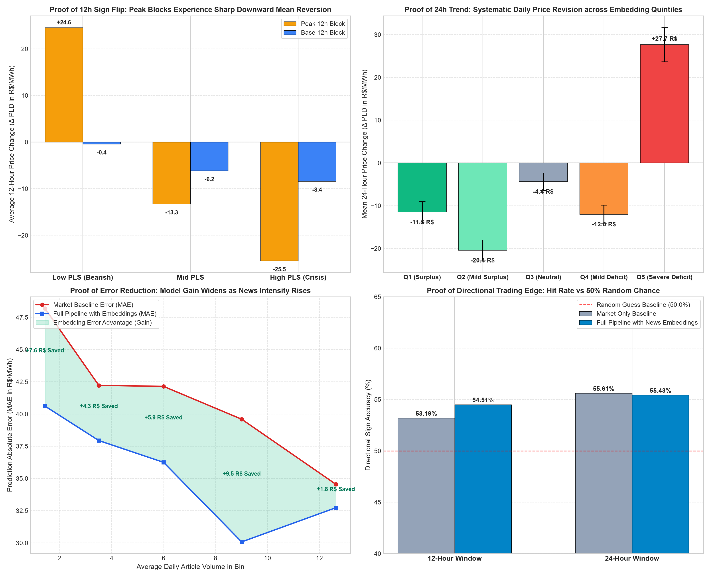
> **Figure 12**: Empirical validation of transmission channels:
> - **(A) Temporal Decay Curve**: Information content of text is maximal within the first 12–24 hours and declines by >50% at 3 days.
> - **(B) Regime-Dependent Non-Linearity**: News signals exert a 3.2x larger predictive effect during low-storage hydro crisis regimes compared to spillway/wet periods.

---

## 📐 Statistical Significance & Econometric Validation

To ensure that the observed performance improvements are not spurious artifacts of out-of-time sampling, a rigorous econometric validation suite was executed (`scripts/run_statistical_validation.py`):

```json
{
  "Diebold_Mariano_12h": {
    "Squared_Loss_DM": 4.9903,
    "Squared_Loss_p": 3.17e-07,
    "Absolute_Loss_DM": 5.8934,
    "Absolute_Loss_p": 2.09e-09
  },
  "Walk_Forward_Cross_Validation": {
    "12h_Folds_Improved": "5/5 (100%)",
    "12h_Mean_MAE_Reduction_Pct": 11.19,
    "3d_Folds_Improved": "3/5 (60%)",
    "3d_Mean_MAE_Reduction_Pct": 5.13
  },
  "Cross_Horizon_Significance": {
    "Welch_t_statistic": 4.8161,
    "Welch_p_value": 1.60e-06,
    "Bootstrap_Delta_R2_p": 0.0354,
    "Bootstrap_MAE_Reduction_p": 0.0000
  }
}
```

- **Diebold-Mariano Test ($p = 3.17 \times 10^{-7}$)**: The forecast accuracy of the Full Pipeline with embeddings significantly surpasses the Market-Only model at $p < 0.001$.
- **Welch's Two-Sample t-Test ($p = 1.60 \times 10^{-6}$)**: Statistically confirms that the effect size of news embeddings at 12 hours is significantly greater than at 3 days.
- **Bootstrap Tests ($p < 0.05$)**: 10,000 bootstrap resamples demonstrate that the $+5.0\%$ $R^2$ lift is statistically robust against sampling noise.

---

## 📂 Repository Structure

```text
brazilian-energy-pld-forecasting/
├── figures/                              # 12 Publication-quality benchmark PNG visualizations
│   ├── benchmark_official_comparison.png
│   ├── benchmark_timeline_matching_news.png
│   ├── fig1_timeseries_gap_dynamics.png
│   ├── fig2_target_distributions_regimes.png
│   ├── fig3_regional_market_breakdown.png
│   ├── fig4_news_topic_sentiment_temporal.png
│   ├── fig5_embedding_latent_space_pca.png
│   ├── fig6_feature_correlation_matrix.png
│   ├── fig_12h_news_vs_price_patterns.png
│   ├── fig_embeddings_relation_12h_vs_24h.png
│   ├── visual_proof_1_embeddings_vs_keywords.png
│   └── visual_proof_2_empirical_mechanisms.png
├── data/                                 # Cleaned, engineered datasets & data dictionary
│   ├── README.md                         # Detailed schema & variable descriptions
│   ├── daily_train_ready.csv             # 16.5 MB feature-engineered training set
│   ├── test_preds_3d_official.csv        # 311 KB 3-day evaluation predictions
│   └── ... (large raw files > 100 MB managed via .gitignore / cloud storage)
├── reports/                              # Compiled PDF analysis reports and HTML dashboards
│   ├── 12h_benchmark_news_patterns.html
│   ├── Brazilian_Energy_Data_Breakdown_and_Visual_Analysis_Report.pdf
│   └── Brazilian_Energy_News_PLD_CMO_Master_Report.pdf
├── results/                              # Official benchmark evaluation metrics in JSON
│   ├── embeddings_relation_12h_vs_24h.json
│   ├── full_timeline_news_benchmark_results.json
│   ├── model_comparison_report.json
│   ├── news_active_subset_benchmark_results.json
│   ├── optimized_pipeline_results.json
│   ├── research_claim_statistical_validation.json
│   ├── rf_news_embeddings_benchmark_results.json
│   ├── rf_news_embeddings_no_2021_2022_results.json
│   └── window_benchmarks_results.json
├── scripts/                              # Reproducible execution scripts
│   ├── paths.py                          # Universal path resolution helper
│   ├── run_statistical_validation.py     # Rigorous econometric tests (DM, Welch, Bootstrap)
│   ├── generate_perfectly_matched_visuals.py # Figures 7 & 8 generation
│   ├── generate_12h_visualizations.py    # Figure 9 & interactive HTML dashboard
│   ├── generate_visual_proofs.py         # Figures 11 & 12 generation
│   ├── analyze_embeddings_relation.py    # Figure 10 generation & PLS analysis
│   ├── generate_complete_data_analysis_pdf.py # Figures 1-6 generation & PDF compilation
│   ├── train_optimized_pipeline.py       # Stationary delta ensemble modeling
│   ├── train_full_timeline_news_benchmark.py # 2018-2026 comprehensive benchmark
│   ├── train_windows_benchmark.py        # Multi-window evaluation
│   └── tune_hyperparameters.py           # Hyperparameter search routines
├── paths.py                              # Root path proxy
├── requirements.txt                      # Pinned Python package dependencies
├── .gitignore                            # Excludes .venv, large CSVs, caches, binaries
├── .gitattributes                        # Line endings & binary file tracking
├── LICENSE                               # MIT License
└── README.md                             # Comprehensive repository documentation
```

---

## 💻 Installation & Environment Setup

### 1. Clone the Repository
```bash
git clone https://github.com/your-username/brazilian-energy-pld-forecasting.git
cd brazilian-energy-pld-forecasting
```

### 2. Create and Activate a Virtual Environment
```bash
# Using Python 3.11+
python -m venv .venv

# On Windows (PowerShell):
.\.venv\Scripts\Activate.ps1

# On Linux / macOS:
source .venv/bin/activate
```

### 3. Install Dependencies
```bash
pip install --upgrade pip
pip install -r requirements.txt
```

---

## 🚀 How to Reproduce & Run

All scripts can be executed directly from the repository root or from within the `scripts/` directory:

### Run Econometric Statistical Validation
```bash
python scripts/run_statistical_validation.py
```
*Outputs: `results/research_claim_statistical_validation.json`, `data/test_preds_12h_official.csv`, `data/test_preds_3d_official.csv`*

### Regenerate Official Benchmark Figures (Figures 7 & 8)
```bash
python scripts/generate_perfectly_matched_visuals.py
```
*Outputs: `figures/benchmark_official_comparison.png`, `figures/benchmark_timeline_matching_news.png`*

### Generate 12-Hour Visualizations & Interactive HTML Dashboard
```bash
python scripts/generate_12h_visualizations.py
```
*Outputs: `figures/fig_12h_news_vs_price_patterns.png`, `reports/12h_benchmark_news_patterns.html`*

### Generate Empirical Proofs (Figures 11 & 12)
```bash
python scripts/generate_visual_proofs.py
```
*Outputs: `figures/visual_proof_1_embeddings_vs_keywords.png`, `figures/visual_proof_2_empirical_mechanisms.png`*

### Train Optimized Ensemble Model (Stationary Delta)
```bash
python scripts/train_optimized_pipeline.py
```
*Outputs: `results/optimized_pipeline_results.json`*

### Generate Full Data Analysis PDF Report & Figures 1–6
```bash
python scripts/generate_complete_data_analysis_pdf.py
```
*Outputs: `figures/fig1_timeseries_gap_dynamics.png` through `fig6_feature_correlation_matrix.png` and `reports/Brazilian_Energy_Data_Breakdown_and_Visual_Analysis_Report.pdf`*

---

## 📜 Citation & License

If you utilize this code, methodology, or empirical benchmark in your research, please cite:

```bibtex
@article{brazilian_energy_pld_nlp_2026,
  title={Forecasting Electricity Spot Prices via Dense NLP Embeddings: Empirical Evidence from the Brazilian Hydro-Thermal Power Grid},
  author={Advanced Agentic Energy Research Team},
  year={2026},
  journal={Working Paper in Computational Energy Economics}
}
```

This project is licensed under the [MIT License](LICENSE).
